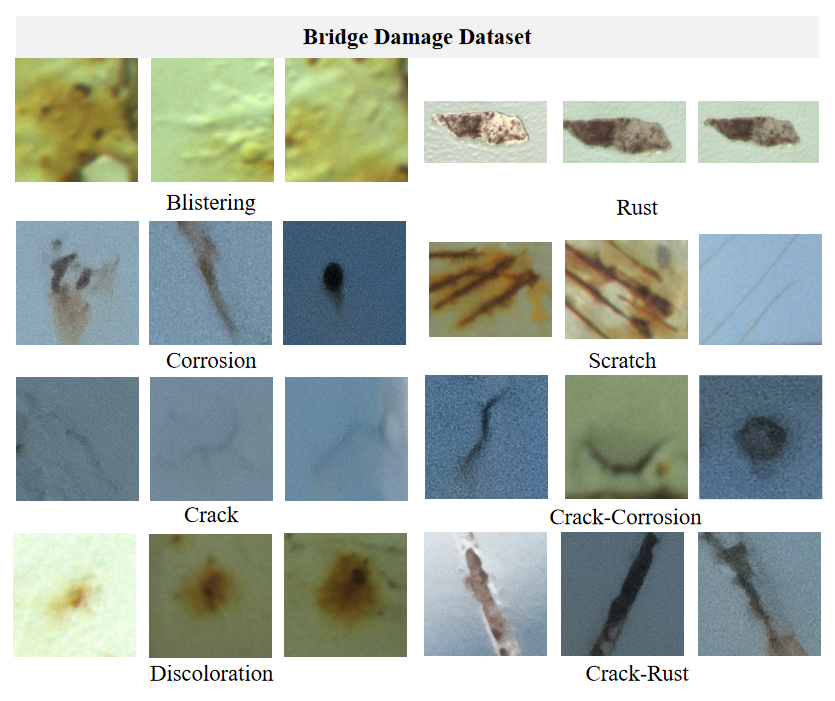

# MVIT_metal_datasets
*Provided by Machine Vision and Industrial Testing Laborator (MVIT Lab).*

## 📌 Overview
We release two metal surface defect datasets with instance-level pixel annotations: Casting Billet and Steel Pipe. Additionally, we provide a Medium and Heavy Plate Surface Defect Dataset annotated in YOLO format, along with an unlabeled bridge damage dataset.

## 🗃️ Datasets
### 1. Casting Billet Dataset
- **Images**: 1,060 (780 defective)
- **Resolution**: 96×106 to 3,228×492
- **Defect Types**:
  - Scratch
  - Weld slag 
  - Cutting opening
  - Water slag mark
  - Slag skin
  - Longitudinal crack

### 2. Steel Pipe Dataset
- **Images**: 1,227 (554 defective) 
- **Resolution**: 728×544 (fixed)
- **Defect Types**:
  - Warp
  - External fold
  - Wrinkle 
  - Scratch

### 3. Medium and Heavy Plate Surface Defect Dataset
- **Images**: 680 (480 defective) 
- **Resolution**: 256×256 (fixed)
- **Defect Types**:
  - Inclusions (In)(120 samples)
  - Blocky Scale (Bs)(120 samples)
  - Striated Scale (Ss)(120 samples)
  - Foreign Object Embedding (Foe)(120 samples)

### 4. Bridge Damage Dataset
- **Images**: 781 (489 defective) + 21 Sets of Evolutionary Defects
- **Resolution**: 47x51 to 1,782 x 1,457
- **Defect Types**:
  - Blistering
  - Corrosion
  - crack
  - Discoloration
  - rust
  - scratch
  - crack-Corrosion
  - crack-rust

## ✏️ Annotation Process

1. **AI Pre-segmentation**  
   Leverage SAM's predictive interface to perform batch automatic segmentation, generating initial masks based on the provided bounding box annotations and images.

2. **Expert Refinement**  
   1). **Identification of Suboptimal Segmentation**:  
      Review the initial masks to identify suboptimal segmentation results through human assessment.

   2). **Interactive Refinement**:  
      For suboptimal results, use SAM's interactive segmentation by iteratively adding:  
      - **Positive sample points** to guide the identification of the target region.  
      - **Negative sample points** to exclude interference regions.  
      Continuously update the segmentation results in real-time until the desired accuracy is achieved.

   3). **Post-processing**:  
      - Perform threshold-based segmentation using optimal thresholds for the specific dataset.  
      - Apply morphological operations, including **opening** and **closing**, to smooth edges, eliminate noise, fill holes, and perform other enhancements.


## 🖼️ Samples




## 📥 Download
[Download Link(baiduyun)](https://pan.baidu.com/s/1uYLvkAdRHw3TKjiJIHuO1A?pwd=uk4f) | [Alternative links(google drive)](https://drive.google.com/drive/folders/1f9UpmgPlYF2i7s83XP09sc_k7PIT1bNM?usp=sharing)
Bridge Damage Dataset: [Download Link(baiduyun)](https://pan.baidu.com/s/1bYwlKuW1iktA5nAZ1Lj5mg?pwd=7j8s) 

## 📜 Citation
```bibtex
@article{liu2025advancing,
  title={Advancing Metallic Surface Defect Detection via Anomaly-Guided Pretraining on a Large Industrial Dataset},
  author={Liu, Chuni and Li, Hongjie and Du, Jiaqi and Hou, Yangyang and Sun, Qian and Jin, Lei and Xu, Ke},
  journal={arXiv preprint arXiv:2509.18919},
  year={2025}
}

@article{li2025few,
  title={A Few-Shot Steel Surface Defect Generation Method Based on Diffusion Models},
  author={Li, Hongjie and Liu, Yang and Liu, Chuni and Pang, Hongxuan and Xu, Ke},
  journal={Sensors},
  volume={25},
  number={10},
  pages={3038},
  year={2025},
  publisher={MDPI}
}
```

## 📧 Contact
For dataset inquiries or collaboration opportunities:  📧 [xuke@ustb.edu.cn](mailto:xuke@ustb.edu.cn) 📧 [chuniliu@xs.ustb.edu.cn](mailto:chuniliu@xs.ustb.edu.cn)

---

**Maintained by** [MVIT Lab](https://cicst.ustb.edu.cn/rcpy/yjsds/bssds1/2d415f8ca1f54cc6abafe9b7c10ba665.htm) @ [Collaborative Innovation Center of Steel Technology](https://cicst.ustb.edu.cn/), [University of Science and Technology Beijing](https://www.ustb.edu.cn)
